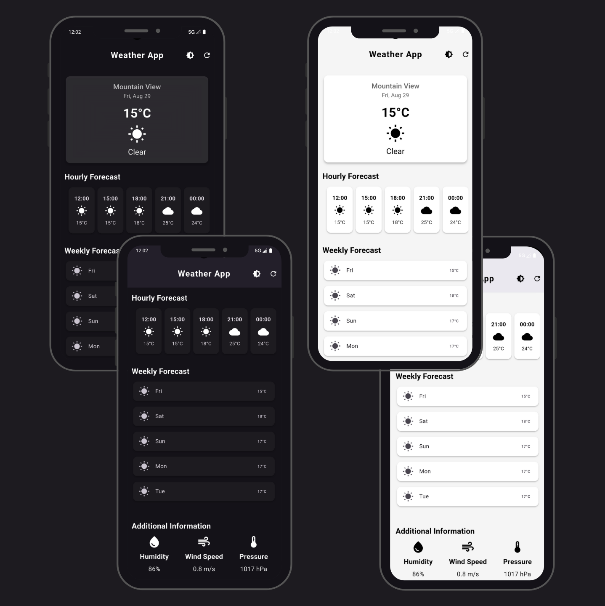

# Weather App

A sleek and modern Flutter weather application that provides real-time weather updates, hourly forecasts, weekly forecasts, and detailed weather information for your current location. The app supports both dark and light modes and features a clean, user-friendly UI.

## Features

- ⏰ **3-Hour Forecast:** Get a quick glance at the next 24 hours in 3-hour intervals.  
- 📅 **5-Day Forecast:** Plan ahead with a daily summary of temperature and conditions.  
- 💧 **Weather Details:** Quick view of humidity, wind speed, and atmospheric pressure.  
- 🌗 **Dark & Light Mode:** Toggle between themes for day/night comfort.  
- 🔄 **Refresh Anytime:** Update weather data with a single tap.  
- 📍 **Smart Location:** Automatically fetches weather for your current location.  

## Screenshot

 

## Getting Started

### Prerequisites

- Flutter SDK installed. [Install Flutter](https://docs.flutter.dev/get-started/install)
- An editor like VS Code or Android Studio
- Internet connection to fetch weather data

### Installation

1. Clone the repository:

```bash
git clone https://github.com/codewith-rafi/weather_app.git
````

2. Navigate to the project directory:

```bash
cd weather_app
```

3. Install dependencies:

```bash
flutter pub get
```

4. Run the app:

```bash
flutter run
```

## Folder Structure

```
lib/
├─ main.dart              
├─ screen/
│  └─ weather_screen.dart 
├─ services/
│  └─ weather_service.dart 
├─ info/
│  └─ information.dart    
├─ forecast/
   ├─ hourly_forecast.dart  
   └─ weeekly_forecast.dart 
```

## API

This project uses the **OpenWeatherMap API**. You will need an API key to fetch weather data. Replace the key in `weather_service.dart` with your own if needed.

## Limitations & Future Improvements

* Currently supports only current location weather.
* Weekly forecast is approximated from 3-hour forecasts.
* Future improvements:

  * Add city search functionality
  * Include weather animations/icons
  * Add notifications for weather alerts
  * Improve error handling and offline support

## Resources

* [Flutter Documentation](https://docs.flutter.dev/)
* [OpenWeatherMap API](https://openweathermap.org/api)

## License

This project is licensed under the MIT License - see the LICENSE file for details.

---

Made with ❤️ by [Rafi](https://github.com/codewith-rafi)
